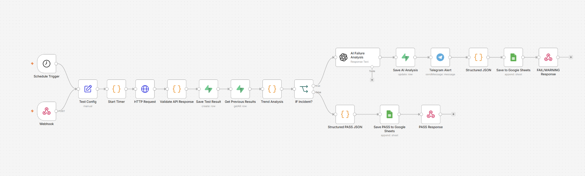
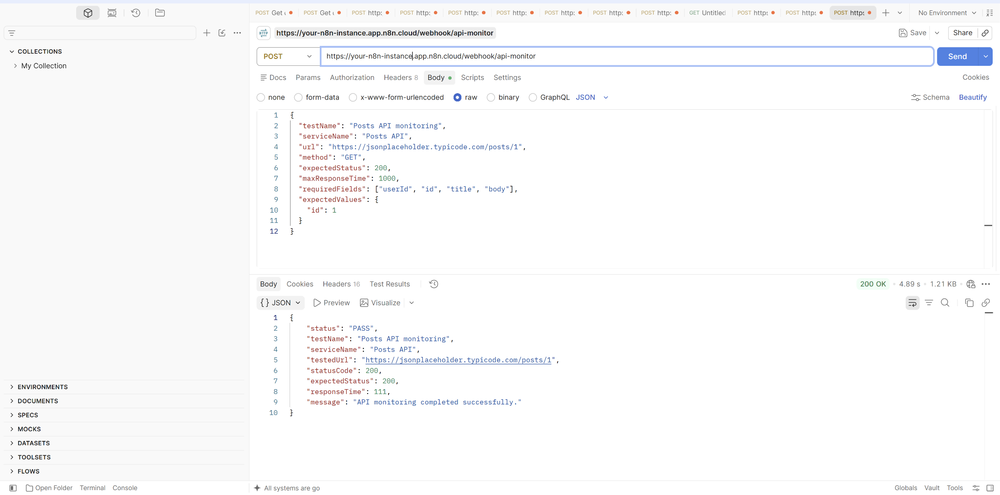
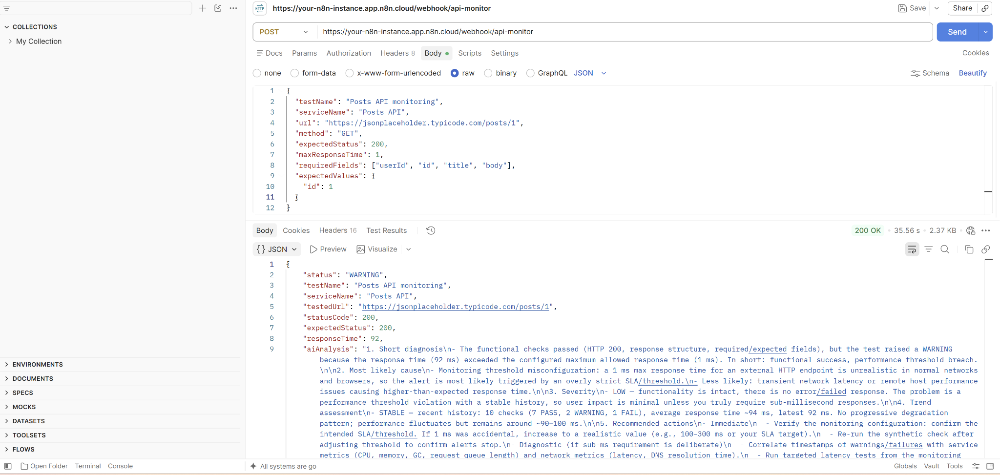
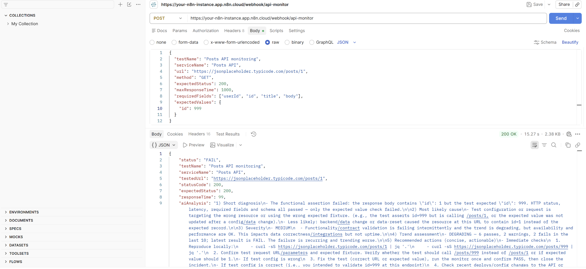
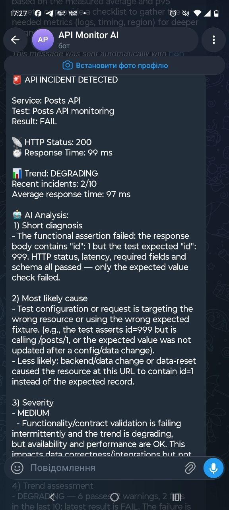

# 🤖 AI-Powered API Incident & Reliability Monitor

An intelligent API monitoring and incident analysis workflow built with **n8n, OpenAI, Supabase, Telegram, Google Sheets, and JavaScript**.

The system automatically monitors API health, validates responses, analyzes historical performance, detects incidents, and uses AI to generate technical diagnostics and recommended actions.

When an issue is detected, the workflow performs AI-powered incident analysis, sends a real-time Telegram alert, and stores monitoring results for further analysis.

## 🔄 Workflow Overview



---

## 🚀 Key Features

- Automated API monitoring every 15 minutes
- Webhook-based manual API testing
- HTTP status validation
- Response time monitoring
- Required JSON fields validation
- Expected values validation
- Response structure validation
- Automatic **PASS / WARNING / FAIL** classification
- Historical monitoring data stored in Supabase
- Analysis of the latest monitoring results
- API performance trend detection
- AI-powered incident diagnosis
- AI-generated severity assessment
- Recommended troubleshooting actions
- Real-time Telegram incident alerts
- Google Sheets monitoring logs
- Structured JSON API responses

---

## 🏗️ How It Works

The workflow can be started in two ways:

**Schedule Trigger** — automatically runs API monitoring every 15 minutes.

**Webhook** — allows an API test to be triggered manually or from an external application such as Postman.

```text
Schedule Trigger ─┐
                  ├──> Test Config
Webhook ──────────┘
                       ↓
                   Start Timer
                       ↓
                  HTTP Request
                       ↓
              Validate API Response
                       ↓
                Save Test Result
                    (Supabase)
                       ↓
              Get Previous Results
                       ↓
                 Trend Analysis
                       ↓
                  IF Incident?
                  /           \
               NO               YES
               ↓                 ↓
       Structured PASS      AI Failure Analysis
             JSON                ↓
               ↓          Save AI Analysis
        Google Sheets         (Supabase)
               ↓                 ↓
        PASS Response       Telegram Alert
                                 ↓
                          Structured JSON
                                 ↓
                           Google Sheets
                                 ↓
                       FAIL/WARNING Response
```

---

## 🔍 API Validation

Each API response is checked against several reliability criteria.

### 1. HTTP Status

The actual HTTP status code is compared with the expected status code.

### 2. Response Time

The workflow measures API response time and compares it with a configurable maximum response time.

### 3. Required Fields

The response is checked for required JSON fields.

```json
["userId", "id", "title", "body"]
```

### 4. Expected Values

Specific response values can also be validated.

```json
{
  "id": 1
}
```

### 5. Response Structure

The workflow verifies that the API returns the expected response structure.

---

## 🚦 PASS / WARNING / FAIL Classification

### ✅ PASS

The API behaves as expected:

- HTTP status is correct
- Response time is within the configured limit
- Required fields exist
- Expected values match
- Response structure is valid

### PASS Example



---

### ⚠️ WARNING

A WARNING is generated when the functional API checks pass but the response time exceeds the configured threshold.

For testing purposes, the maximum response time can be intentionally reduced:

```json
{
  "maxResponseTime": 1
}
```

This allows the monitoring workflow to demonstrate detection of a performance issue.

### WARNING Example



---

### ❌ FAIL

A FAIL is generated when a critical validation check fails, for example:

- Incorrect HTTP status
- Missing required fields
- Incorrect expected values
- Invalid response structure

For example, the test can expect:

```json
{
  "id": 999
}
```

while the API actually returns:

```json
{
  "id": 1
}
```

The workflow detects the mismatch and automatically starts the incident-analysis process.

### FAIL Example



---

## 📊 Historical Trend Analysis

Monitoring results are stored in **Supabase**.

The workflow retrieves recent monitoring history and calculates:

- PASS count
- WARNING count
- FAIL count
- Average response time
- Latest response time
- Number of recent incidents

Based on recent monitoring history, the system determines an API trend such as:

```text
STABLE
DEGRADING
SLOWING_DOWN
```

This means an incident is evaluated not only from the current API response, but also from recent historical behavior.

---

## 🧠 AI-Powered Incident Analysis

When a **WARNING** or **FAIL** is detected, the workflow sends the current test result together with recent monitoring history to an OpenAI model.

The AI acts as an API reliability engineer and generates:

1. Short diagnosis
2. Most likely cause
3. Severity assessment
4. Trend assessment
5. Recommended actions

Severity levels include:

```text
LOW
MEDIUM
HIGH
CRITICAL
```

AI analysis is only triggered for incidents, avoiding unnecessary AI calls for successful API checks.

---

## 🚨 Real-Time Telegram Alerts

After AI incident analysis, the workflow automatically sends a Telegram alert.

The notification contains:

- Service name
- Test name
- Incident result
- HTTP status
- Response time
- Current trend
- Recent incident count
- Average response time
- AI-generated diagnosis
- Severity assessment

### Telegram Incident Alert



In this example, the system detected a **FAIL**, identified a **DEGRADING** trend, assessed the incident as **MEDIUM** severity, and generated a technical diagnosis automatically.

---

## 🗄️ Supabase Monitoring History

Supabase is used as the monitoring history database.

Stored information includes:

- Test name
- Service name
- Tested URL
- Result
- HTTP status
- Response time
- Validation results
- Missing fields
- Incorrect values
- Response body
- Test timestamp
- AI incident analysis

Historical records are then used by the Trend Analysis step.

---

## 📈 Google Sheets Reporting

Both successful tests and incidents are automatically logged to Google Sheets.

The monitoring log contains information such as:

- Timestamp
- Service
- Test
- Result
- HTTP status
- Response time
- Validation results
- Current trend
- Historical statistics
- AI analysis

This provides a simple monitoring report that can be reviewed without accessing n8n or the database.

---

## 🧪 Example Webhook Request

The project was tested using the JSONPlaceholder API:

`https://jsonplaceholder.typicode.com/posts/1`

Example request:

```json
{
  "testName": "Posts API monitoring",
  "serviceName": "Posts API",
  "url": "https://jsonplaceholder.typicode.com/posts/1",
  "method": "GET",
  "expectedStatus": 200,
  "maxResponseTime": 1000,
  "requiredFields": ["userId", "id", "title", "body"],
  "expectedValues": {
    "id": 1
  }
}
```

---

## 🛠️ Tech Stack

| Technology | Purpose |
|---|---|
| **n8n** | Workflow automation and orchestration |
| **JavaScript** | API validation and trend analysis |
| **REST API / Webhooks** | API communication |
| **OpenAI** | AI-powered incident analysis |
| **Supabase / PostgreSQL** | Monitoring history |
| **Telegram Bot API** | Real-time incident notifications |
| **Google Sheets** | Monitoring reports |
| **Postman** | API testing |

---

## 📦 n8n Workflow

The sanitized n8n workflow is included in this repository:

```text
ai-api-incident-monitor.json
```

The public workflow does **not** contain private API keys, tokens, Telegram Chat IDs, or personal integration credentials.

After importing the workflow into n8n, configure your own:

- Supabase credentials and database
- OpenAI connection
- Telegram Bot credentials and Chat ID
- Google Sheets credentials and spreadsheet

---

## 🔐 Security

Sensitive credentials and personal integration identifiers are intentionally excluded from the public repository.

Never commit API keys, access tokens, database secrets, Telegram bot tokens, or other credentials to a public repository.

---

## 💡 What I Learned

This project gave me practical experience with:

- Workflow automation with n8n
- REST API monitoring
- Webhooks
- JavaScript-based API validation
- API reliability concepts
- Historical monitoring and trend analysis
- AI integration into automation workflows
- Prompt design for technical incident analysis
- PostgreSQL / Supabase integration
- Telegram automation
- Google Sheets reporting
- Postman API testing
- PASS / WARNING / FAIL scenario testing

---

## 👩‍💻 Author

**Inna Konopatska**

Junior Full-Stack Developer | AI & Automation

GitHub: [Inna-code10](https://github.com/Inna-code10)

---

⭐ **This project demonstrates how API monitoring can be combined with workflow automation, historical trend analysis, and AI-assisted incident diagnostics to create an automated reliability monitoring system.**
